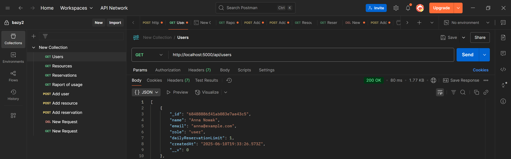
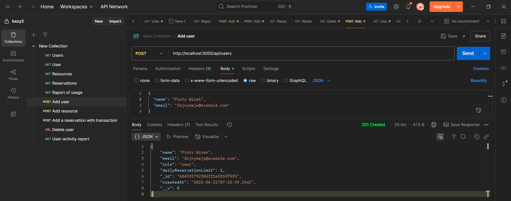

# Miniprojekt system rezerwacji sal/ pokoi/ stanowisk pracy – MongoDB, Node.js, Express

Miniprojekt - System Rezerwacji Sal / Pokoi / Stanowisk Pracy.
Opis: Użytkownicy mogą rezerwować zasoby (sale konferencyjne, pokoje, stanowiska w coworkingu) na określony czas.

Operacje CRUD:
Tworzenie / edycja / usuwanie rezerwacji

Zarządzanie zasobami (sale/pokoje)

Zarządzanie użytkownikami

Operacje z transakcjami:
Rezerwacja sali — upewnianie się, że nie ma konfliktu czasowego (kontrola dostępu i blokowanie w razie konfliktów)

Raporty agregacyjne:
Zarządzanie rezerwacjami i użytkownikami
Statystyki wykorzystania zasobów

---
<style>
  {
    font-size: 10pt;
    line-height: 1.1; 
  }
</style>

<style scoped>
 li, p {
    font-size: 9pt;
    line-height: 1.1; 
  }
</style>

<style>
  pre, pre code {
    font-size: 7pt;
    font-family: Consolas, monospace;
    line-height: 1.1; 
  }
</style>

**Imiona i nazwiska autorów:**
Agnieszka Mirosław, Mateusz Nowak

---
## Tabele

Struktura bazy danych - tabele, z jakich będzie składała się baza:

1. **Tabela users** - użytkownicy bazy danych

```js
{
  _id: ObjectId,
  name: String,
  email: String, // unikalny adres email - zabezpieczony przez dodanie indeksu unikalnego
  role: String, // "user" / "admin"
  dailyReservationLimit: Number,
  createdAt: Date
}
```

2. **Tabela resources** - opisująca wszystkie zasoby, jakie znajdują się w danym biurze. W naszym przypadku choci o wszystkie sale, pokoje, stanowiska, jakie można zarezerwować:

```js
{
  _id: ObjectId,
  name: String,
  type: String, // "sala" / "pokój" / "stanowisko"
  location: String,
  capacity: Number,
  features: [String], // opis wszystkich urządzeń / akcesoriów, jakie znajdują się w danym pokoju np. ["projektor", "monitor", "klimatyzacja"]
  isActive: Boolean,
  createdAt: Date
}
```

3. **Tabela reservations** - służąca zapisywaniu wszystkich rezerwacji zasobów z poprzedniej tabeli do użytkownika z pierwszej tabeli:

```js
{
  _id: ObjectId,
  userId: ObjectId, // referencja do użytkownika
  resourceId: ObjectId, // referencja do zasobu
  startTime: Date,
  endTime: Date,
  status: String, // "active"/ "cancelled"/ "completed"
  createdAt: Date
}
// Tabela ta posiada dodatkowe indeksy unikalne:
// - zabezpieczający przed podwójnymi rezerwacjami, zawierający datę i godzinę rezerwacji i id zasobu
// - zabezpieczający przed przekroczeniem limitu rezerwacji dziennych dla danego użytkownika
```

4. **Tabela z logami** - służąca zapisywaniu wszystkich operacji przeprowadzonych na bazie danych:

```js
{
  _id: ObjectId,
  type: String, // "create", "cancel", "fail".
  userId: ObjectId,
  reservationId: ObjectId,
  timestamp: Date,
  description: String
}
```

b) Kod MongoDB użyty do stowrzenia bazy danych:
Podczas tworzenia kolekcji narzucamy im strukturę korzystając z walidacji JSON-Schema.

1. Kolekcja użytkowników

```js
db.createCollection("users", {
  validator: {
    $jsonSchema: {
      bsonType: "object",
      required: ["name", "email", "role", "dailyReservationLimit", "createdAt"],
      properties: {
        name: {
          bsonType: "string",
          description: "musi być tekstem",
        },
        email: {
          bsonType: "string",
          pattern: "^.+@.+$",
          description: "musi być poprawnym adresem e-mail",
        },
        role: {
          enum: ["user", "admin"],
          description: "musi być jednym z: user, admin",
        },
        dailyReservationLimit: {
          bsonType: "int",
          minimum: 0,
          description: "musi być liczbą całkowitą ≥0",
        },
        createdAt: {
          bsonType: "date",
          description: "musi być datą",
        },
      },
    },
  },
  validationLevel: "moderate", // lub "strict"
});
```

2. Kolekcja Kolekcja zasobów (sale / pokoje / stanowiska)

```js
db.createCollection("resources", {
  validator: {
    $jsonSchema: {
      bsonType: "object",
      required: [
        "name",
        "type",
        "location",
        "capacity",
        "isActive",
        "createdAt",
      ],
      properties: {
        name: { bsonType: "string" },
        type: { enum: ["sala", "pokój", "stanowisko"] },
        location: { bsonType: "string" },
        capacity: { bsonType: "int", minimum: 1 },
        features: {
          bsonType: "array",
          items: { bsonType: "string" },
        },
        isActive: { bsonType: "bool" },
        createdAt: { bsonType: "date" },
      },
    },
  },
});
```

3. Kolekcja rezerwacji

```js
db.createCollection("reservations", {
  validator: {
    $jsonSchema: {
      bsonType: "object",
      required: [
        "userId",
        "resourceId",
        "startTime",
        "endTime",
        "status",
        "createdAt",
      ],
      properties: {
        userId: { bsonType: "objectId" },
        resourceId: { bsonType: "objectId" },
        startTime: { bsonType: "date" },
        endTime: { bsonType: "date" },
        status: { enum: ["active", "cancelled", "completed"] },
        createdAt: { bsonType: "date" },
      },
    },
  },
});
```

4. Kolekcja logów

```js
db.createCollection("logs", {
  validator: {
    $jsonSchema: {
      bsonType: "object",
      required: ["type", "userId", "reservationId", "timestamp", "description"],
      properties: {
        type: { enum: ["create", "cancel", "fail", "update"] },
        userId: { bsonType: "objectId" },
        reservationId: { bsonType: "objectId" },
        timestamp: { bsonType: "date" },
        description: { bsonType: "string" },
      },
    },
  },
});
```

c)

## Indeksy

Podczas tworzenia tabel swtorzyliśmy również odpowiednie indeksy, które przyspieszają wyszukiwanie i filtrowanie danych w kolekcjach, poprawiają wydajność zapytań (zwłaszcza tych, które często wykonujesz) oraz umożliwiają wymuszanie unikalności (np. adresu e-mail). Dzięki nim operacje typu „znajdź rezerwacje tego użytkownika” czy „sprawdź konflikty czasowe” będą działać znacznie szybciej, nawet gdy w bazie będzie milion dokumentów.

1. Wymusza unikalność adresu e-mail i przyspiesza wyszukiwanie użytkownika po e-mailu.

```js
db.users.createIndex(
  { email: 1 },
  { unique: true, name: "idx_users_email_unique" }
);
```

2. Umożliwia szybkie filtrowanie zasobów wg rodzaju (sala/pokój/stanowisko) oraz statusu aktywności.

```js
db.resources.createIndex(
  { type: 1, isActive: 1 },
  { name: "idx_resources_type_active" }
);
```

3. Przyspiesza detekcję konfliktów czasowych rezerwacji dla danego zasobu.

```js
db.reservations.createIndex(
  { resourceId: 1, startTime: 1, endTime: 1 },
  { name: "idx_resv_resTime" }
);
```

4. Pozwala szybko wyliczyć liczbę rezerwacji użytkownika w danym dniu (limit dzienny).

```js
db.reservations.createIndex(
  { userId: 1, startTime: 1 },
  { name: "idx_resv_userTime" }
);
```

5. Umożliwia szybkie przeglądanie logów w kolejności od najnowszych.

```js
db.logs.createIndex({ timestamp: -1 }, { name: "idx_logs_timestamp" });
```

d)

## CRUD – operacje na kolekcjach

Dla każdej z czterech kolekcji (`users`, `resources`, `reservations`, `logs`) zaimplementowano pełen zestaw endpointów HTTP z wykorzystaniem Express + Mongoose. Poniżej opis i przykładowe żądania.

### Users

**POST** `/api/users`  
Tworzy nowego użytkownika.  
Body (JSON):

```js
{
  "name": "Jan Test",
  "email": "jan.test@example.com",
  "role": "user",
  "dailyReservationLimit": 1
}
```

Response 201:

```js
[
  {
    "_id": "68480b61235f5673826c4bd0",
    "name": "Jan Kowalski",
    "email": "jan.kowalski@example.com",
    "role": "user",
    "dailyReservationLimit": 1,
    "createdAt": "2025-06-10T10:39:29.501Z"
  },
  { … }
]

```

GET `/api/users`
Pobiera listę wszystkich użytkowników.
Response 200:

```js
  [
    {
      "_id": "68480b61235f5673826c4bd0",
      "name": "Jan Kowalski",
      "email": "jan.kowalski@example.com",
      "role": "user",
      "dailyReservationLimit": 1,
      "createdAt": "2025-06-10T10:39:29.501Z"
    },
    { … }
  ]
```

GET `/api/users/:id`
Pobiera pojedynczego użytkownika po jego `_id`.
Response 200: dokument użytkownika
Response 404:

```json
** `{ "error": "Nie znaleziono" }`
```

PUT `/api/users/:id`
Aktualizuje dane użytkownika.
Body (JSON):

```json
{ "name": "Jan Nowy" }
```

Response 200: zaktualizowany dokument
Response 400/404: błąd walidacji lub „Nie znaleziono”

DELETE `/api/users/:id`
Usuwa użytkownika.
Jeśli zasób istnieje →Response 200: `{ "msg": "Usunięto" }`
Response 400/404: błąd ID lub „Nie znaleziono”

### Resources

`POST /api/resources`

Tworzy nowy zasób (sale/pokój/stanowisko).

Body (JSON):

```json
{
  "name": "Sala Konferencyjna A",
  "type": "sala",
  "location": "Piętro 2",
  "capacity": 10,
  "features": ["projektor", "klimatyzacja"],
  "isActive": true
}
```

Response 201:

```json
{
  "_id": "68480b62235f5673826c4bd5",
  "name": "Sala Konferencyjna A",
  "type": "sala",
  "location": "Piętro 2",
  "capacity": 10,
  "features": ["projektor", "klimatyzacja"],
  "isActive": true,
  "createdAt": "2025-06-10T10:39:30.200Z",
  "__v": 0
}
```

`GET /api/resources`

Pobiera listę wszystkich zasobów.

Response 200:

```json
[
  {
    "_id": "68480b62235f5673826c4bd5",
    "name": "Sala Konferencyjna A",
    "type": "sala",
    "location": "Piętro 2",
    "capacity": 10,
    "features": ["projektor","klimatyzacja"],
    "isActive": true,
    "createdAt": "2025-06-10T10:39:30.200Z"
  },
  {
    "_id": "68480b62235f5673826c4bd6",
    "name": "Pokój C",
    "type": "pokój",
    "location": "Piętro 3",
    "capacity": 4,
    "features": ["monitor"],
    "isActive": true,
    "createdAt": "2025-06-10T10:39:30.200Z"
  },
  …
]
```

`GET /api/resources/:id`

Opis: Pobiera pojedynczy zasób po jego `_id`.

- Jeśli zasób istnieje → Response 200 i dokument JSON.
- Jeśli brak → Response 404:

  ```json
  { "error": "Nie znaleziono" }
  ```

---

`PUT /api/resources/:id`

Aktualizuje wybrane pola zasobu.

Body (JSON):

```json
{ "capacity": 12 }
```

- Jeśli aktualizacja się powiodła → Response 200 i zaktualizowany dokument.
- W przypadku nieistniejącego `_id` → Response 404 `{ "error": "Nie znaleziono" }`
- W przypadku walidacji (np. niewłaściwy typ) → Response 400 i `{ "error": "<komunikat błędu>" }`

Przykład Response 200:

```json
{
  "_id": "68480b62235f5673826c4bd5",
  "name": "Sala Konferencyjna A",
  "type": "sala",
  "location": "Piętro 2",
  "capacity": 12,
  "features": ["projektor", "klimatyzacja"],
  "isActive": true,
  "createdAt": "2025-06-10T10:39:30.200Z",
  "__v": 0
}
```

`DELETE /api/resources/:id`

Opis: Usuwa zasób o podanym `_id`.

- Jeśli usunięcie się powiodło → Response 200:

  ```json
  { "msg": "Usunięto" }
  ```

- Jeśli brak zasobu → **Response 404**:

  ```json
  { "error": "Nie znaleziono" }
  ```

- Jeśli podano nieprawidłowe ID → Response 400.

### Reservations

POST /api/reservations  
Tworzy nową rezerwację.  
Body (JSON):

```json
{
  "userId": "68480b61235f5673826c4bd0",
  "resourceId": "68480b62235f5673826c4bd5",
  "startTime": "2025-06-15T09:00:00Z",
  "endTime": "2025-06-15T10:00:00Z",
  "status": "active"
}
```

Response 201:

```json
{
  "_id": "68480b62235f5673826c4bdd",
  "userId": "68480b61235f5673826c4bd0",
  "resourceId": "68480b62235f5673826c4bd5",
  "startTime": "2025-06-15T09:00:00.000Z",
  "endTime": "2025-06-15T10:00:00.000Z",
  "status": "active",
  "createdAt": "2025-06-10T10:39:30.491Z",
  "__v": 0
}
```

GET /api/reservations
Zwraca tablicę wszystkich rezerwacji.
Response 200:

```json
[
  {
    "_id": "68480b62235f5673826c4bdd",
    "userId": "68480b61235f5673826c4bd0",
    "resourceId": "68480b62235f5673826c4bd5",
    "startTime": "2025-06-10T06:00:00.000Z",
    "endTime": "2025-06-10T07:00:00.000Z",
    "status": "cancelled",
    "createdAt": "2025-06-10T10:39:30.491Z"
  },
  {
    "_id": "68480b62235f5673826c4bde",
    "userId": "68480b61235f5673826c4bd1",
    "resourceId": "68480b62235f5673826c4bd6",
    "startTime": "2025-06-10T07:00:00.000Z",
    "endTime": "2025-06-10T08:00:00.000Z",
    "status": "active",
    "createdAt": "2025-06-10T10:39:30.491Z"
  },
  …
]
```

GET /api/reservations/\:id
Pobiera jedną rezerwację po `_id`.
Response 200: dokument rezerwacji
Response 404:

```json
{ "error": "Nie znaleziono" }
```

PUT /api/reservations/\:id
Zmienia wybrane pola rezerwacji.
Body (JSON):

```json
{ "status": "cancelled" }
```

Response 200: zaktualizowany dokument
Response 400/404: błąd walidacji lub „Nie znaleziono”

DELETE /api/reservations/\:id
Usuwa rezerwację o podanym `_id`.
Response 200:

```json
{ "msg": "Usunięto" }
```

Response 400/404: błąd ID lub „Nie znaleziono”

### Logs

POST /api/logs  
Tworzy nowy wpis w logach.  
Body (JSON):

```json
{
  "type": "create",
  "userId": "68480b61235f5673826c4bd0",
  "reservationId": "68480b62235f5673826c4bdd",
  "description": "Testowy wpis"
}
```

Response 201:

```json
{
  "_id": "68480b62235f5673826c4bf1",
  "type": "create",
  "userId": "68480b61235f5673826c4bd0",
  "reservationId": "68480b62235f5673826c4bdd",
  "timestamp": "2025-06-10T10:39:30.704Z",
  "description": "Testowy wpis",
  "__v": 0
}
```

GET /api/logs
Zwraca tablicę wszystkich wpisów w logach.
Response 200:

```json
[
  {
    "_id": "68480b62235f5673826c4bf1",
    "type": "cancel",
    "userId": "68480b61235f5673826c4bd0",
    "reservationId": "68480b62235f5673826c4bdd",
    "timestamp": "2025-06-10T10:39:30.704Z",
    "description": "Log wpis numer 1"
  },
  {
    "_id": "68480b62235f5673826c4bf2",
    "type": "create",
    "userId": "68480b61235f5673826c4bd1",
    "reservationId": "68480b62235f5673826c4bde",
    "timestamp": "2025-06-10T10:39:30.704Z",
    "description": "Log wpis numer 2"
  },
  …
]
```

GET /api/logs/\:id
Pobiera pojedynczy wpis po `_id`.
Response 200: dokument logu
Response 404:

```json
{ "error": "Nie znaleziono" }
```

PUT /api/logs/\:id
Aktualizuje opis lub inne pola wpisu.
Body (JSON):

```json
{ "description": "Zmieniony opis" }
```

Response 200: zaktualizowany dokument
Response 400/404: błąd walidacji lub „Nie znaleziono”

DELETE /api/logs/\:id
Usuwa wpis o podanym `_id`.
Response 200:

```json
{ "msg": "Usunięto" }
```

Response 400/404: błąd ID lub „Nie znaleziono”

## Podsumowanie prostych operacji CRUD
Powyższe endpointy dla kolekcji users, resources, reservations oraz logs pozwalają na pełne zarządzanie danymi: tworzenie, odczyt, edycję i usuwanie rekordów. Każda operacja zwraca odpowiednie kody HTTP (201 dla utworzenia, 200 dla powodzenia, 400/404 przy błędach), a walidacja pól oraz obsługa wyjątków gwarantują spójność i poprawność danych. Dzięki zastosowaniu Mongoose Schema i middleware `express.json()` mamy automatyczną konwersję i wstępną weryfikację JSON-ów, a indeksy w MongoDB zapewniają wydajne filtrowanie i wyszukiwanie nawet przy rosnącej liczbie dokumentów. CRUD stanowi solidną bazę pod kolejne funkcjonalności: transakcje rezerwacji oraz raporty agregujące dane.

## Transakcje
 Poniżej znajduje się kod transakcji, służącej dodaniu rezerwacji do bazy danych. W przypadku błędu, transakcja jest wycofywana, a użytkownik otrzymuje odpowiedni komunikat.
```js
// Rezerwacja z transakcją
// route: POST /api/reservations/safe
router.post('/safe', async (req, res) => {
  const session = await mongoose.startSession();
  session.startTransaction();

  try {
    const { userId, resourceId, startTime, endTime } = req.body;

    // Sprawdź limit dzienny użytkownika
    const user = await User.findById(userId).session(session);
    if (!user) throw new Error('Nie znaleziono użytkownika');

    const startOfDay = new Date(startTime);
    startOfDay.setUTCHours(0, 0, 0, 0);

    const endOfDay = new Date(startTime);
    endOfDay.setUTCHours(23, 59, 59, 999);

    const todayReservations = await Reservation.countDocuments({
      userId,
      startTime: { $gte: startOfDay, $lte: endOfDay },
    }).session(session);

    if (todayReservations >= user.dailyReservationLimit) {
      throw new Error('Przekroczono dzienny limit rezerwacji');
    }

    // Sprawdź kolizje czasowe
    const conflict = await Reservation.findOne({
      resourceId,
      $or: [
        { startTime: { $lt: endTime, $gte: startTime } },
        { endTime: { $gt: startTime, $lte: endTime } },
        { startTime: { $lte: startTime }, endTime: { $gte: endTime } }
      ]
    }).session(session);

    if (conflict) {
      throw new Error('Zasób już zajęty w tym czasie');
    }

    // Utwórz rezerwację
    const reservation = await Reservation.create([{ userId, resourceId, startTime, endTime }], { session });

    // Zaloguj operację
    await Log.create([{
      type: 'create',
      userId,
      reservationId: reservation[0]._id,
      description: 'Rezerwacja utworzona przez transakcję'
    }], { session });

    await session.commitTransaction();
    res.status(201).json(reservation[0]);

  } catch (err) {
    await session.abortTransaction();
    res.status(400).json({ error: err.message });
  } finally {
    session.endSession();
  }
});
```


## Raporty z agregacją danych

Poniżej znajdują się przykłady raportów, które można wygenerować z danych w bazie MongoDB. Używamy agregacji MongoDB do przetwarzania i analizy danych. 
 W pierwszym przykładzie raportujemy wykorzystanie zasobów, a w drugim aktywność użytkowników. W tym celu wykorzystujemy funkcje agregacji MongoDB, takie jak `$group`, `$lookup`, `$project` i `$sort`. Agregujemy dane z kolekcji `reservations`, `users`, `resources`, aby uzyskać szczegółowe informacje o rezerwacjach i aktywności użytkowników.
```js
// Raport rezerwacji zasobów
router.get('/usage', async (req, res) => {
  try {
    const results = await Reservation.aggregate([
      {
        $group: {
          _id: '$resourceId',
          totalReservations: { $sum: 1 },
          users: { $addToSet: '$userId' }
        }
      },
      {
        $lookup: {
          from: 'resources',
          localField: '_id',
          foreignField: '_id',
          as: 'resource'
        }
      },
      {
        $unwind: '$resource'
      },
      {
        $project: {
          _id: 0,
          resourceName: '$resource.name',
          resourceType: '$resource.type',
          totalReservations: 1,
          totalUniqueUsers: { $size: '$users' }
        }
      },
      { $sort: { totalReservations: -1 } }
    ]);

    res.json(results);

  } catch (err) {
    res.status(500).json({ error: err.message });
  }
});
```

```js
// Raport o aktywności użytkownika 
router.get('/user-activity', async (req, res) => {
  try {
    const data = await Reservation.aggregate([
      {
        $group: {
          _id: '$userId',
          totalReservations: { $sum: 1 },
          completed: {
            $sum: {
              $cond: [{ $eq: ['$status', 'completed'] }, 1, 0]
            }
          },
          lastReservation: { $max: '$startTime' }
        }
      },
      {
        $lookup: {
          from: 'users',
          localField: '_id',
          foreignField: '_id',
          as: 'user'
        }
      },
      { $unwind: '$user' },
      {
        $lookup: {
          from: 'logs',
          localField: '_id',
          foreignField: 'userId',
          as: 'userLogs'
        }
      },
      {
        $project: {
          _id: 0,
          userId: '$user._id',
          name: '$user.name',
          email: '$user.email',
          totalReservations: 1,
          completed,
          lastReservation: 1,
          logCount: { $size: '$userLogs' }
        }
      },
      { $sort: { totalReservations: -1 } }
    ]);

    res.json(data);

  } catch (err) {
    res.status(500).json({ error: err.message });
  }
});
```
## Testowanie w Postman-ie
Wszystkie zapytania przetestowaliśmy w pogramie Postman, by dodać dane do bazy, oraz przetestować poprawność implementacji backendu. Transakcja ta zapewnia, że w przypadku błędu podczas tworzenia rezerwacji, wszystkie zmiany zostaną wycofane, a użytkownik otrzyma odpowiedni komunikat o błędzie. Poniżej znajduje się zrzut ekranu z Postmana, który pokazuje przykładowe zapytanie do endpointu tworzącego rezerwację. 





## Podsumowanie
W miniprojekcie stworzyliśmy dokumentową bazę danych MongoDB do zarządzania rezerwacjami zasobów. Zdefiniowaliśmy cztery główne kolekcje: `users`, `resources`, `reservations` i `logs`, każda z odpowiednią strukturą i walidacją. Implementacja CRUD pozwala na pełne zarządzanie danymi, a transakcje zapewniają bezpieczeństwo operacji rezerwacji. Dodatkowo, raporty agregacyjne umożliwiają analizę wykorzystania zasobów i aktywności użytkowników. Całość została zrealizowana przy użyciu Express i Mongoose, co zapewnia elastyczność i wydajność aplikacji.
## Wnioski
Projekt pozwolił na praktyczne zastosowanie dokumentowych baz danych w kontekście rezerwacji zasobów. MongoDB okazało się elastycznym narzędziem, które umożliwia łatwe modelowanie danych i szybkie operacje CRUD. Dzięki walidacji JSON-Schema zapewniliśmy spójność danych, a indeksy przyspieszyły wyszukiwanie i filtrowanie. Transakcje pozwoliły na bezpieczne zarządzanie rezerwacjami, a agregacja danych umożliwiła tworzenie użytecznych raportów. Projekt pokazał również, jak ważne jest planowanie struktury bazy danych i indeksów już na etapie projektowania, co przekłada się na wydajność i skalowalność aplikacji.
## Bibliografia
- Dokumentacja MongoDB: https://docs.mongodb.com/manual/
- Dokumentacja Mongoose: https://mongoosejs.com/docs/
- Dokumentacja Express: https://expressjs.com/
- Artykuł o transakcjach w MongoDB: https://docs.mongodb.com/manual/core/transactions/
- Artykuł o agregacji w MongoDB: https://docs.mongodb.com/manual/aggregation/